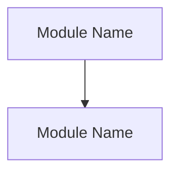

# Module Plan

## Instructions

- This file is used to confirm module breakdown, page/menu feature coverage, dependencies, development order, and parallelizable work before formal PRD body writing begins.
- Do not assume a fixed number of modules. Split modules dynamically according to the Product Shipping Brief, current PRD template, feature complexity, page entries, data objects, permission differences, and engineering delivery boundaries.
- When feature behavior, permissions, data objects, or acceptance criteria differ significantly, split into smaller modules. Merge multiple capabilities only when they share the same user flow, business rules, and engineering ownership.
- Module IDs use sequential numbering. If skipped numbers, duplicate numbers, or inconsistencies with the PRD body appear, fix the plan before continuing writing.
- After this file is updated, output a planning summary in chat for user confirmation; do not only ask the user to open the file.
- This section only guides generation of the module plan document. Do not output this instruction section in the formal generated plan.

## Planning Basis

- Source brief:
- PRD template:
- Module splitting principle: dynamically split by user flows, page menus, backend capabilities, external interfaces, data dependencies, and engineering delivery boundaries; do not assume a fixed module count.

## Module List

The module list is used to confirm each module's boundary, target users, and dependencies. Scope should clearly state what is included and not included to avoid repeated rework during PRD appending.

| ID | Module | Module Goal | Scope | Primary Users/Objects | Dependencies |
|----|--------|-------------|-------|-----------------------|--------------|
| 1 | F01 | | | | |

## Feature List

List feature coverage by page, menu, or entry point. This list helps product, design, and engineering understand feature scope from UI entry points and stay consistent with the PRD requirement overview.

| Page/Menu | Module | Feature | Feature Description |
|-----------|--------|---------|---------------------|
|           |        |         |                     |

## Module Dependency Diagram

Use a Mermaid flowchart or equivalent diagram to show dependencies. Focus on prerequisites such as login permissions, system configuration, foundational data, external interfaces, AI context, data flow, and reports/dashboards.

## Recommended Development Order

The development order should explain why certain work comes earlier or later. Common sorting bases include foundational permissions, system configuration, core data objects, main business flows, enhanced capabilities, reports/dashboards, audit logs, and so on. The specific order must be adjusted to the current brief and must not copy examples mechanically.

| Order | Module | Reason |
|-------|--------|--------|
| 1 | F01 | |

## Parallel Development Recommendation

- Parallelizable modules:
- Parallel prerequisites:
- Modules not recommended for parallel development and reasons:

## User Confirmation Checklist

Ask the user to confirm the following before writing the PRD body:

- Whether the module breakdown is reasonable, and whether any module is too large, too small, or missing.
- Whether page/menu feature coverage is complete.
- Whether module dependencies match real business and engineering implementation order.
- Whether the recommended development order matches MVP priority and delivery rhythm.
- Which modules can be developed in parallel and which must wait for prerequisites.

## Current Review Status

Waiting for the user to confirm the module list, page/menu feature list, dependencies, and development order. After confirmation, start formal PRD body writing from the first body writing unit in the current PRD template.
