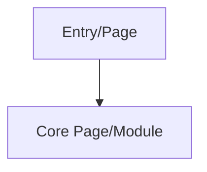
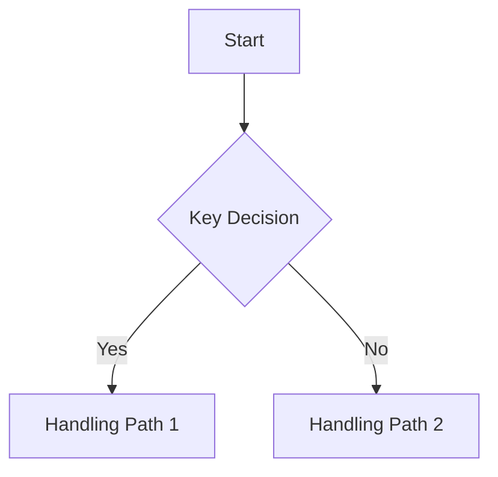
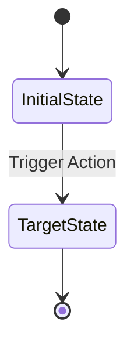
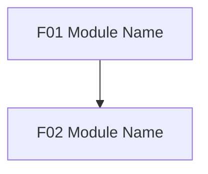

# PRD Document

## Instructions

- This template defines the PRD body structure, section order, heading levels, table fields, and feature module merge format.
- During writing, proceed from top to bottom according to this template; do not skip preceding sections that have not yet been confirmed.
- Feature module IDs use consecutive `FXX` numbering, such as `F01-F08` or `F01-F15`; the specific count follows the confirmed module plan.
- Business rules, acceptance criteria, permissions, data objects, and cross-module references should use module IDs or feature IDs where possible so engineering, QA, and reviewers can trace them.
- Pending decisions are not written into the PRD body or feature module body; record them centrally in the independent `Decision Log.md`.
- This section only guides how to generate the PRD document. Do not output this section when generating the formal PRD document.

## 0. Document Information

| Field | Content |
|-------|---------|
| Product Name | |
| Version | |
| Owner | |
| Source Brief | |
| Last Updated | |

## 1. Project Background and Scope

### 1.1 Background

Explain the product background, business status quo, existing problems, brief source, and basis for this PRD. Avoid marketing language and focus on why this should be built.

### 1.2 Goals

Explain the product goals, business goals, or process improvement goals expected from this delivery. Goals should correspond to subsequent feature scope and acceptance criteria.

### 1.3 Success Metrics

List observable or measurable success metrics. When metrics cannot be quantified, explain the basis for judgment.

### 1.4 MVP Scope

List the capability boundaries that must be delivered in this version. Scope should map to the subsequent feature module list.

### 1.5 Deferred Scope

List items explicitly not included in this delivery, preventing engineering or reviewers from assuming they are included by default.

## 2. Users and Scenarios

### 2.1 User Roles

Describe target users, backend roles, administrative roles, external systems, or other user objects, and mark key permission differences.

### 2.2 Core Scenarios

Describe core scenarios by user goals or business trigger conditions, covering normal paths, key branches, and high-frequency exceptions.

### 2.3 User Stories

Maintain product-level user stories by feature module. Plan the quantity reasonably according to the Product Shipping Brief and module complexity.
Do not repeat "user stories" inside feature module bodies; maintain user stories only in this section.

| No. | Module | As a | I want | So that | Priority |
|-----|--------|------|--------|---------|----------|
| 1 | F01 | | | | P0 |

### 2.4 JTBD Analysis

Analyze the user's job to be done, trigger conditions, expected outcomes, and obstacles. The content should support feature prioritization and scope decisions.

### 2.5 Scenario Priority

Explain core scenario priorities, sorting rationale, and MVP tradeoff basis.

## 3. Product Solution Overview

### 3.1 Information Architecture

Use a Mermaid flowchart, tree diagram, or tabular structure to express information architecture. Do not use a plain-text indented tree as the final draft. Keep node labels concise and put detailed rules in body explanations or feature modules.

### 3.2 Core Data Model

Describe core data objects, object relationships, key fields, ownership relationships, and lifecycle states. For complex data relationships, use tables or diagrams.

### 3.3 Main Flow

Use a Mermaid flowchart to express the main flow, clearly showing key paths such as entry, decisions, creation, filtering, handling, failure, and end.

### 3.4 State Machine

Use a Mermaid stateDiagram or state transition table to express key object state transitions. If there are few states, still explain trigger actions, preconditions, and terminal states.

### 3.5 User Permissions

Explain what different roles, objects, or permission scopes can see, can operate, and cannot operate. Avoid only writing abstract permission names.

## 4. Requirement Overview

### 4.1 Feature Module List

This section must stay consistent with the confirmed `Module Plan.md`. Module goals, scope, primary users, and dependencies should be clear enough for engineering to judge delivery boundaries.

| ID | Module | Scope | Primary Users | Dependencies |
|----|--------|-------|---------------|--------------|
| F01 | | | | |

### 4.2 Page/Menu Feature List

List feature coverage by page, menu, or entry point so product, design, and engineering can understand requirement scope from UI entries.

| Page/Menu | Module | Feature | Feature Description |
|-----------|--------|---------|---------------------|
|           |        |         |                     |

### 4.3 Module Dependency Diagram

Use a Mermaid flowchart to show module dependencies. Nodes should retain module IDs and module names; edges represent prerequisite dependencies, data dependencies, permission dependencies, or flow dependencies.

### 4.4 Recommended Development Order

Explain the recommended development order, sorting rationale, and parallelizable items. If certain modules must first complete login permissions, system configuration, data foundations, or external interfaces, state that clearly.

## 5. Functional Requirements

Append confirmed functional requirements here.

Format requirements:

- Append feature requirements module by module according to the confirmed module plan. Every feature module needs separate review and confirmation.
- When writing detailed modules, do not only write a large module description; expand feature points one by one under the module so product, design, engineering, and QA can review by feature point.
- Module titles use level-3 headings in the format `### 5.x FXX Module Name`.
- Feature titles use level-4 headings in the format `#### 5.x.y FXX-YY Feature Name`.
- Do not repeat "module goal", "module feature list", or "user stories" under modules. Module goals and feature lists should be reflected in `4.1 Feature Module List` and the feature titles in the module body. User stories are maintained only in `2.3 User Stories`.
- Inside each feature, explanation items use bold numbered body text in the fixed order: `**1. Feature Goal**`, `**2. Flow and Page Interaction**`, `**3. State Description**`, `**4. Business Rules**`, `**5. Data Requirements**`, `**6. Acceptance Criteria**`, `**7. Permissions**`.
- Do not generate a separate `**2.1 Main Flow**`; when steps are needed, merge them into `**2. Flow and Page Interaction**`.
- State-related content is centralized in `**3. State Description**`, covering empty states, exception states, loading states, disabled states, success/failure states, and so on.
- Feature-level permissions go into `**7. Permissions**` inside each feature. Do not generate a separate module-level permission subsection.
- Pending decisions are not written into the PRD body or feature module body; record them centrally in the independent `Decision Log.md`.

Feature module writing template:

The following content guides feature module generation. In the formal PRD, do not output the explanatory text "Feature module writing template" or "Pre-review check before submitting feature module"; generate only confirmed modules and feature details according to the structure below.

### 5.x FXX Module Name

The module title uses a level-3 heading. Replace `5.x` with the actual position in the PRD body; `FXX` must match the confirmed module plan.

#### 5.x.1 FXX-01 Feature Name

The feature title uses a level-4 heading. Feature numbering inside the module starts from `FXX-01` and increments consecutively, without skipped or reused numbers.

**1. Feature Goal**

Explain the specific problem solved by this feature point. The feature goal should state the user, trigger scenario, problem solved, and expected result. Do not use marketing language.

**2. Flow and Page Interaction**

Describe entry points, preconditions, pages/areas, key components, user operations, system feedback, and exit or next step. When steps are needed, merge them into this section as a table or explanation.

| Page/Area | Entry | Key Components | Exit/Next Step |
|-----------|-------|----------------|----------------|
|           |       |                |                |

**3. State Description**

Describe empty states, exception states, loading states, disabled states, success states, failure states, insufficient-permission states, and so on in one place.

| State | Trigger Condition | UI/System Behavior |
|-------|-------------------|--------------------|
|       |                   |                    |

**4. Business Rules**

Business rules should be traceable, implementable, and verifiable. When modules, features, permissions, states, or data objects are involved, reference corresponding IDs or names where possible.

1. XXXX
2. XXXX

**5. Data Requirements**

Describe the data objects, fields, types, requiredness, default values, sources, read/write rules, or constraints involved in this feature. Add text explanation when fields are insufficient.

| Object | Field | Type | Required | Notes |
|--------|-------|------|----------|-------|
|        |       |      |          |       |

**6. Acceptance Criteria**

Acceptance criteria must be testable and use consecutive `AC-FXX-YY-ZZ` numbering. Each criterion should be convertible by QA into a test case; avoid unverifiable descriptions such as "good experience" or "correct display."

- [ ] AC-FXX-01-01:
- [ ] AC-FXX-01-02:

**7. Permissions**

Explain visible, operable, and inoperable rules under different roles, objects, data scopes, or states. If all roles behave the same, explicitly state the consistent scope.

| Role/Object | Permission | Description |
|-------------|------------|-------------|
|             |            |             |

#### 5.x.2 FXX-02 Feature Name

Continue expanding other feature points under the module with the same structure.

Pre-review check before submitting feature module:

- Module ID is consistent with `Module Plan.md`.
- Module title and feature titles have been replaced with actual numbering in the PRD body.
- Feature IDs inside the module are consecutive.
- Every feature contains feature goal, flow and page interaction, state description, business rules, data requirements, acceptance criteria, and permissions.
- Feature details contain no module goal, module feature list, user story, module-level permission, or pending decision subsection.
- State content is centralized in `**3. State Description**`.
- Pending decisions have been written into the independent `Decision Log.md`.

## 6. Non-Functional Requirements

Write non-functional requirements according to the Product Shipping Brief and system complexity. In addition to performance requirements, add usability, security and audit, data retention, reliability, compatibility, maintainability, and other content as needed. If analysis shows they are unnecessary, other subsections may be omitted.

### 6.1 Performance Requirements

| No. | Requirement | Description |
|-----|-------------|-------------|
| 1 | | |

### 6.x Other Non-Functional Requirements

Add usability, security and audit, data retention, compatibility, reliability, and other non-functional requirements according to the Product Shipping Brief and system complexity. If analysis shows they are unnecessary, no subsections other than `6.1 Performance Requirements` are required.

## 7. Data Tracking

Data tracking must cover key user behaviors, key system events, and key exception paths. Event names, trigger timing, and key properties should support later data analysis, operations review, or quality monitoring.

| No. | Event Name | Trigger Timing | Key Properties | Purpose |
|-----|------------|----------------|----------------|---------|
| 1 | | | | |

## 8. Exception Handling and Risks

Centralize cross-module exceptions, systemic risks, dependency risks, data risks, permission risks, launch risks, and mitigation plans. Local exceptions inside a module can be written in the corresponding feature details, but risks requiring cross-team attention should be summarized in this section.
