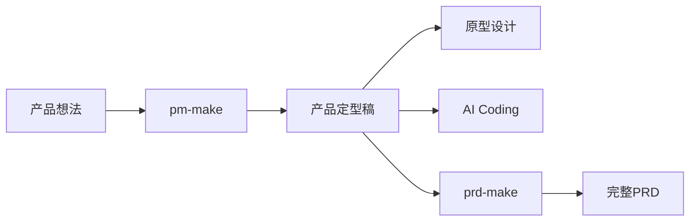

# PRD Make Skill

一套面向产品经理的 AI 协作工作流。

很多 PRD 工具喜欢一步到位：

> 输入一句话需求，输出一篇几十页的 PRD。

看起来效率很高，但实际项目里经常会遇到一个问题：

> PRD 写出来了，需求却还没真正想清楚。

所以这个项目采用了另一种思路：

**先把产品定义清楚，再把文档写完整。**

整个工作流拆分为两个独立 Skill：

```text
pm-make
prd-make
```

分别对应产品工作的两个阶段：



---

## 为什么做这个？

做产品的人应该都经历过这样的场景：

开会讨论了一堆需求，

回来准备写 PRD，

结果发现：

- 用户是谁没说清楚
- MVP 范围还在变化
- 权限规则没定
- 页面流程还没统一
- 技术边界不明确

于是 PRD 写着写着，又回到了需求讨论阶段。

很多 AI PRD 工具的问题也类似：

它们很擅长生成文档，

但不一定能帮助你完成产品定义。

而产品定义，往往才是最重要的工作。

所以这套 Skill 更关注：

- 把需求问清楚
- 把边界划清楚
- 把决策记录下来
- 再生成文档

让 PRD 成为产品决策的结果，而不是决策过程本身。

---

## 项目结构

```text
.
├── pm-make/
│   ├── SKILL.md
│   ├── agents/
│   └── assets/templates/
│
├── prd-make/
│   ├── SKILL.md
│   ├── agents/
│   └── assets/templates/
```

项目包含两个独立 Skill。

请不要将整个仓库作为一个 Skill 使用，而是分别安装：

```text
pm-make
prd-make
```

---

## 第一阶段：pm-make

适用于：

- 只有一个模糊想法
- 需求还在讨论阶段
- MVP 范围尚未确定
- 准备开始原型设计
- 准备后续编写 PRD
- 准备交给 AI Coding

例如：

```text
使用 pm-make skill 帮我定型：

我想做一个销售团队使用的 AI CRM，
支持客户管理、跟进记录、
AI 客户分析和销售提醒。
```

---

### pm-make 会做什么？

pm-make 会帮助你逐步收敛需求，整理并确认：

- 产品定位
- 用户角色
- JTBD 场景
- MVP 范围
- 页面结构
- 核心流程
- 数据对象
- 权限规则
- 开放问题

对于影响产品行为的重要决策，Skill 会优先提问，而不是默认帮你做决定。

---

### pm-make 输出内容

最终会生成 6 个文件：

```text
01-基本描述.md
02-JTBD场景.md
03-范围边界.md
04-页面流程.md
05-开放问题.md
06-最终定型稿.md
```

#### 01-基本描述

记录最初的产品想法、背景和目标。

#### 02-JTBD场景

记录用户任务、使用场景和核心价值。

#### 03-范围边界

明确：

- 做什么
- 不做什么
- MVP 包含什么

#### 04-页面流程

记录页面结构、导航关系和核心业务流程。

#### 05-开放问题

记录：

- 待确认事项
- 风险项
- 后续决策

#### 06-最终定型稿

冻结版产品定义。

这是后续所有工作的主要输入。

可以直接用于：

- AI Coding
- 原型生成
- UI 设计
- 技术评审
- 编写 PRD

---

## 第二阶段：prd-make

适用于：

- 已完成产品定型
- 已确认产品边界
- 准备进入研发评审阶段

例如：

```text
使用 prd-make skill 基于产品定型稿生成完整 PRD。
使用默认模板。
```

---

### prd-make 工作方式

与很多 PRD 生成工具不同，prd-make 不会一次性生成几十页文档。

而是采用增量写作方式：

```text
读取产品定型稿
      ↓
生成模块规划
      ↓
确认模块拆分
      ↓
逐模块编写 PRD
      ↓
评审确认
      ↓
继续下一模块
```

这样更符合真实项目中的协作方式：

- 更容易评审
- 更容易修改
- 更容易控制质量
- 更方便追踪变更

---

### prd-make 输出内容

初始化后会生成：

```text
PRD文档.md
模块规划.md
待决策事项.md
追加日志.md
```

#### 模块规划.md

用于定义：

- 功能模块
- 页面覆盖范围
- 模块依赖关系
- 建议开发顺序
- 可并行开发项

#### PRD文档.md

最终 PRD 正文。

#### 待决策事项.md

所有未确认问题统一记录。

避免将假设直接写进正文。

#### 追加日志.md

记录：

- 新增内容
- 修改内容
- 用户确认记录

方便追踪历史变化。

---

## 安装说明

### 安装到 Codex

如果你的 Skill 目录为：

```bash
~/.codex/skills
```

执行：

```bash
git clone git@github.com:IMinnn/PRD-Make-SKILL.git
mkdir -p ~/.codex/skills
cp -R PRD-Make-SKILL/pm-make ~/.codex/skills/
cp -R PRD-Make-SKILL/prd-make ~/.codex/skills/
```

**注意：这是两个 SKILL，请不要将整个PRD-Make-SKILL文件夹放到 agent 的 skill 文件夹中，需要将两个 skill 分开放置在 agent 的 skill 文件夹中**

安装完成后重启 Codex。

---

### 注意事项

不要复制整个仓库：

❌

```text
~/.codex/skills/
└── PRD-Make-SKILL
```

正确方式：

✅

```text
~/.codex/skills/
├── pm-make
└── prd-make
```

因为 Codex 会将每个目录识别为独立 Skill。

---

### 手动安装

也可以直接将以下两个目录复制到 Skill 目录：

```text
pm-make
prd-make
```

请保留完整目录结构：

```text
pm-make/
├── SKILL.md
├── agents/
└── assets/templates/

prd-make/
├── SKILL.md
├── agents/
└── assets/templates/
```

模板文件缺失可能导致初始化失败。

---

## 使用说明

### 场景一：从零开始

```text
产品想法
   ↓
pm-make
   ↓
产品定型稿
   ↓
原型设计
   ↓
prd-make
   ↓
完整 PRD
```

---

### 场景二：直接用于 AI Coding

```text
产品想法
   ↓
pm-make
   ↓
产品定型稿
   ↓
AI Coding
```

很多情况下，AI 编码真正需要的并不是几十页 PRD，而是一份边界清晰、决策明确的产品定义。

---

## 模板说明

两个 Skill 都内置默认模板。

### pm-make 模板

目录：

```text
pm-make/assets/templates/
```

包含：

```text
01-基本描述.md
02-JTBD场景.md
03-范围边界.md
04-页面流程.md
05-开放问题.md
06-最终定型稿.md
```

---

### prd-make 模板

目录：

```text
prd-make/assets/templates/
```

包含：

```text
PRD模板.md
模块规划模板.md
待决策事项模板.md
追加日志模板.md
```

---

### 使用公司模板

支持直接替换为企业内部模板。

推荐使用 Markdown 格式。

例如：

```text
docs/
└── 公司PRD模板.md
```

然后：

```text
使用 prd-make，

基于产品定型稿生成 PRD，

使用 docs/公司PRD模板.md 作为模板。
```

---
