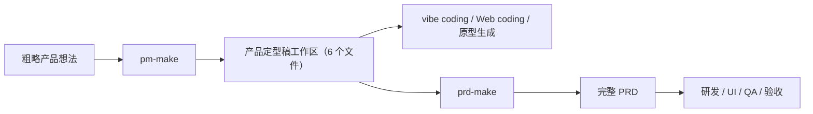

#  PRD Make SKILL

一套面向产品经理的 AI 协作 Skill：先用 `pm-make` 把模糊想法收敛成可执行的产品定型稿，再用 `prd-make` 把定型稿扩展为面向研发、UI、QA 评审的完整 PRD。

这套工作流的目标不是让大模型一次性吐出一篇看似完整的 PRD，而是把产品定义、追问、确认、追加写作和评审拆成可控步骤，让人和 AI 一起把产品想清楚。

## 介绍

很多 PRD 生成类提示词或 Skill 的做法是：给一个需求，直接生成一篇长 PRD。这个方式看起来快，但常见问题也很明显：

- 需求边界没有真正收敛，模型会用默认假设补洞。
- 长文档一次性输出后，状态流转、权限、数据模型、异常处理和验收标准容易遗漏或互相冲突。
- 产品经理很难逐段评审，只能面对一整篇长文档做事后修补。
- PRD 看起来像文档，实际上不能稳定指导研发拆分、设计评审和 QA 验收。

本项目采用两步法：

### 1. 先追问，再定型

`pm-make` 用于把粗略、模糊、尚未定型的产品想法收敛为一份冻结版产品定型稿，也可以理解为 Product Shipping Brief。

它会初始化 6 个结构化 Markdown 文件：

- `01-基本描述.md`
- `02-JTBD场景.md`
- `03-范围边界.md`
- `04-页面流程.md`
- `05-开放问题.md`
- `06-最终定型稿.md`

在这个阶段，AI 不能直接替你做隐含决策。它必须把会影响产品行为、工程范围、数据模型、权限、流程或交付优先级的问题暴露出来，先问阻塞问题，再问非阻塞问题。只有所有开放问题都被用户确认、解决或明确延后，产品定型稿才允许冻结。

冻结后的定型稿通常控制在较短篇幅内，重点写清：

- 一句话定位
- 目标用户
- 核心场景
- 产品形态
- MVP 范围
- 页面与主流程
- 数据与权限
- 暂缓范围
- 已确认决策

这份产品定型稿可以直接指导 vibe coding、Web coding、原型生成或 AI 编码 Agent。对 AI 来说，它比一篇冗长 PRD 更聚焦，更适合作为实现产品原型的唯一事实来源。

### 2. 再追加式写作和评审 PRD

`prd-make` 用于在已有产品定型稿工作区后，基于产品定型阶段生成的 6 个文件生成面向人类研发团队的完整 PRD。

它不会一次性写完整篇 PRD，而是先做模块规划，再逐段、逐模块追加：

1. 根据产品定型阶段的 6 个文件和 PRD 模板生成 `模块规划.md`。
2. 在聊天中输出模块拆分、依赖关系、开发顺序和可并行项，请用户确认。
3. 用户确认模块规划后，才开始写 `PRD文档.md`。
4. 每次只推进一个可评审单元，例如一个章节、一个功能模块或一个小范围修订。
5. 每轮写作后输出摘要，请用户确认，通过后再继续。
6. 新增、修订、确认和跳过都会记录到 `追加日志.md`。
7. 未确认的问题统一记录到 `待决策事项.md`，不藏在正文里。

拒绝一次性输出长 PRD 的原因很简单：PRD 是给人看的，尤其是给研发、设计、QA 和项目协作看。它的价值不只是“有一篇文档”，而是把功能拆成可实现、可评审、可测试、可分工的原子单元。大模型在长任务中容易注意力衰减，人的审阅也会疲劳；追加式写作可以让模型始终聚焦一个小单元，也让产品经理持续参与判断和收敛。

## 安装说明

本仓库包含两个 Skill 目录：

```text
pm-make/
prd-make/
```

每个目录中都包含：

- `SKILL.md`：Skill 的主说明和工作流约束。
- `assets/templates/`：默认 Markdown 模板。
- `agents/openai.yaml`：Agent 配置示例。

### 安装到 Codex

如果你的 Codex Skill 目录是 `~/.codex/skills`，可以执行：

```bash
git git@github.com:IMinnn/PRD-Make-SKILL.git PRD-Make-SKILL
mkdir -p ~/.codex/skills
cp -R PRD-Make-SKILL/pm-make ~/.codex/skills/
cp -R PRD-Make-SKILL/prd-make ~/.codex/skills/
```
**注意：这是两个 SKILL，请不要将整个PRD-Make-SKILL文件夹放到 agent 的 skill 文件夹中，需要将两个 skill 分开放置在 agent 的 skill 文件夹中**
安装后重启 Codex，或开启一个新会话，让 Codex 重新加载 Skill 列表。

### 手动安装

也可以直接把以下两个目录复制到你的 Skill 目录中：

```text
pm-make
prd-make
```

复制时请保留目录结构，尤其是 `SKILL.md` 和 `assets/templates/`。模板文件缺失会影响初始化工作区和后续写作。

## 使用说明

这两个 Skill 推荐配合使用：



### 第一步：使用 pm-make 生成产品定型稿

适用场景：

- 你只有一个粗略想法，还没有完整产品方案。
- 你需要澄清目标用户、核心场景、MVP 范围和边界。
- 你想先生成一份可以指导 AI 编码或原型生成的产品定型稿。
- 你准备后续用 `prd-make` 写完整 PRD。

示例用法：

```text
使用 pm-make，帮我把这个想法定型：
我想做一个面向销售团队的 AI CRM，能管理线索、客户、跟进记录，并通过 AI 帮销售生成客户分析和每日提醒。
```

工作过程：

1. `pm-make` 创建或复用产品工作目录。
2. 初始化 6 个 Markdown 文件。
3. 把原始需求写入 `01-基本描述.md`。
4. 逐个文件补充 JTBD、场景、范围、页面、流程和开放问题。
5. 将缺失信息写入 `05-开放问题.md`，并在聊天中列出当前轮问题。
6. 先解决阻塞问题，再解决非阻塞问题。
7. 所有开放问题关闭后，生成 `06-最终定型稿.md`。
8. 用户确认后，定型稿冻结。

产品定型阶段产出的 6 个文件共同构成 `prd-make` 的输入依据，其中 `06-最终定型稿.md` 是冻结摘要，其他 5 个文件保留了原始需求、JTBD 场景、范围边界、页面流程和问题决策过程。

其中 `06-最终定型稿.md` 可以直接作为：

- vibe coding 的产品说明。
- Web coding 或 AI 编码 Agent 的实现输入。
- 原型生成、页面流程设计、需求评审的基础材料。

而完整的 6 个文件更适合用于后续 `prd-make`，因为 PRD 写作不仅需要冻结结论，也需要追溯这些结论从哪里来、哪些问题被确认、哪些边界被排除。

### 第二步：使用 prd-make 生成完整 PRD

适用场景：

- 你已经有产品定型阶段生成的 6 个文件。
- 你需要把产品方案转成面向研发、UI、QA 的完整 PRD。
- 你希望 PRD 能支持模块化开发、依赖拆分、评审和验收。
- 你不希望 AI 一次性输出不可控长文档。

示例用法：

```text
使用 prd-make，基于 产品定型稿/ 目录中的 6 个文件生成完整 PRD。
如果没有公司模板，就使用 skill 默认模板。
```

工作过程：

1. 提供产品定型稿工作区路径，例如 `产品定型稿/`，其中应包含基本描述、JTBD 场景、范围边界、页面流程、问题与决策、最终定型稿这 6 个文件。
2. 提供公司 PRD 模板；如果没有，则使用 `prd-make/assets/templates/PRD模板.md`。
3. 初始化 PRD 工作区：
   - `PRD文档.md`
   - `模块规划.md`
   - `待决策事项.md`
   - `追加日志.md`
4. 先生成模块规划，不直接写正文。
5. 在聊天中输出模块拆分、页面覆盖、依赖关系、建议开发顺序和可并行项。
6. 用户确认模块规划后，开始按模板顺序写 PRD。
7. 每次只写一个可评审单元。
8. 用户确认后再继续下一个单元。
9. 每次追加、修订或确认都更新 `追加日志.md`。
10. 所有未决问题进入 `待决策事项.md`。

`prd-make` 生成的 PRD 更适合交给人类团队，用于技术拆分、设计评审、排期、测试用例设计和验收。

## 模板说明

两个 Skill 都内置了默认 Markdown 模板。

`pm-make` 默认模板位于：

```text
pm-make/assets/templates/
```

包括：

- `01-基本描述.md`
- `02-JTBD场景.md`
- `03-范围边界.md`
- `04-页面流程.md`
- `05-开放问题.md`
- `06-最终定型稿.md`

`prd-make` 默认模板位于：

```text
prd-make/assets/templates/
```

包括：

- `PRD模板.md`
- `模块规划模板.md`
- `待决策事项模板.md`
- `追加日志模板.md`

你可以直接使用默认模板，也可以替换为自己公司的模板。推荐使用 Markdown 格式，因为 Markdown 更适合 Agent 读取、追加、局部修订和版本管理。

替换模板时建议保留以下原则：

- 明确章节顺序和标题层级。
- 明确功能模块编号规则，例如 `F01`、`F02`。
- 明确功能点编号规则，例如 `F01-01`。
- 把待决策事项放到独立文件，不混入 PRD 正文。
- 把追加、修订、确认记录放到独立日志文件。
- 功能需求中固定包含目标、流程、状态、业务规则、数据要求、验收标准和权限。

如果模板与产品定型稿存在缺口，`prd-make` 应先记录缺口并请用户确认，而不是擅自改造结构或把模型假设写进正文。

## 常见问题与解决方法

### 1. 可以只用 prd-make，不用 pm-make 吗？

可以，但前提是你已经有一份足够清晰、冻结过的产品定型稿、原型摘要或已验证产品方案。否则建议先用 `pm-make`。没有定型稿就直接写 PRD，模型很容易用默认假设补齐关键决策。

### 2. pm-make 生成的产品定型稿能直接给 AI 编码吗？

可以。产品定型稿本来就是更适合 AI 编码、vibe coding、Web coding 和原型生成的输入。它比完整 PRD 更短、更聚焦，能减少模型在实现阶段被长文档噪声干扰。

### 3. 为什么 PRD 不直接给 AI 编码？

PRD 的核心服务对象是人类协作团队。它通常包含大量模块拆分、验收、依赖、评审和管理信息。AI 编码更需要的是边界清晰、决策冻结、没有歧义的产品定型稿。完整 PRD 可以作为辅助材料，但不建议作为 AI 编码的唯一输入。

### 4. 为什么不能一次性生成完整 PRD？

因为长任务会同时放大两个问题：模型注意力衰减和人的审阅疲劳。一次性生成的 PRD 往往看似完整，但容易在权限、状态、异常、数据口径和验收标准上出现缺漏。追加式写作能让每个模块独立评审、独立修订、独立确认。

### 5. 开放问题太多怎么办？

先处理阻塞问题。`pm-make` 会把问题分成阻塞问题和非阻塞问题。阻塞问题会影响产品行为、工程范围、数据模型、权限、流程或交付优先级，必须先确认；非阻塞问题可以在用户明确接受默认值或明确延后后关闭。

### 6. PRD 写作过程中发现新问题怎么办？

写入 `待决策事项.md`。不要把未确认事项藏在正文里，也不要把临时假设写成已确认事实。用户确认后，再同步更新 PRD 正文、模块规划或追加日志。

### 7. 可以换成公司自己的 PRD 模板吗？

可以，而且推荐。把公司模板保存为 Markdown，然后在使用 `prd-make` 时明确提供模板路径。`prd-make` 的规则是以当前模板为准，不强制使用默认章节。

### 8. 模块数量必须固定吗？

不需要。模块数量应根据产品复杂度、页面入口、数据对象、权限差异、状态流转和工程交付边界动态拆分。模块太大不利于研发和评审，模块太小则会增加管理成本。

### 9. 已确认内容后续还能改吗？

可以，但要把修改当作一次正式修订处理。更新受影响的 PRD 正文、模块规划、待决策事项或追加日志，并再次请用户确认，避免前后口径不一致。

### 10. 这个项目适合什么类型的产品？

适合需要把模糊想法收敛为清晰产品方案，并进一步交付研发团队的场景，尤其适合 B 端工具、SaaS、管理后台、AI 应用、Agent 产品、业务系统和复杂功能模块。

## 仓库结构

```text
.
├── pm-make/
│   ├── SKILL.md
│   ├── agents/
│   └── assets/templates/
├── prd-make/
│   ├── SKILL.md
│   ├── agents/
│   └── assets/templates/
```
