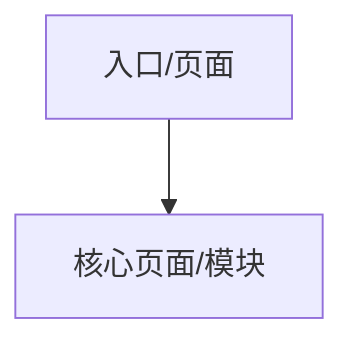
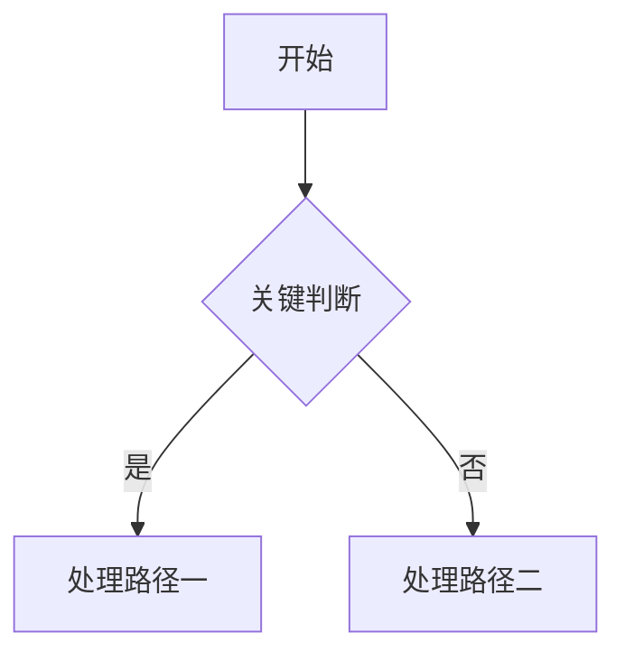
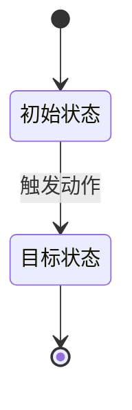
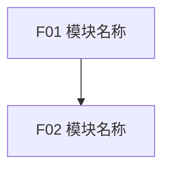

# PRD 文档

## 使用说明

- 本模板定义 PRD 正文结构、章节顺序、标题层级、表格字段和功能模块合并格式。
- 写作时必须按照本模板从上到下推进；不要跳过尚未确认的前置章节。
- 功能模块 ID 使用 `FXX` 连续编号，例如 `F01-F08` 或 `F01-F15`，具体数量以已确认模块规划为准。
- 业务规则、验收标准、权限、数据对象和跨模块引用中应尽量使用模块 ID 或功能 ID，便于研发、QA 和评审追踪。
- 待决策事项不写入 PRD 正文或功能模块正文，统一记录到独立的 `待决策事项.md`。
- 该章节仅指导你如何去生成 prd 文档，在正式生成 prd 文档时不要输出本章节内容。

## 0. 文档信息

| 字段 | 内容 |
|------|------|
| 产品名称 | |
| 版本 | |
| 负责人 | |
| 来源定型稿 | |
| 最后更新时间 | |

## 1. 项目背景与范围

### 1.1 背景

说明产品产生背景、业务现状、现有问题、定型稿来源和本 PRD 的写作依据。避免营销化描述，重点写清为什么要做。

### 1.2 目标

说明本次交付希望达成的产品目标、业务目标或流程改进目标。目标应与后续功能范围和验收标准对应。

### 1.3 成功指标

列出可观察或可衡量的成功指标。无法量化时，也要说明判断依据。

### 1.4 MVP 范围

列出本次必须交付的能力边界。范围应能映射到后续功能模块清单。

### 1.5 暂缓范围

列出明确不在本次交付内的内容，避免研发或评审时误认为默认包含。

## 2. 用户与场景

### 2.1 用户角色

说明目标用户、后台角色、管理角色、外部系统或其他使用对象，并标注关键权限差异。

### 2.2 核心场景

按用户目标或业务触发条件描述核心场景，覆盖正常路径、关键分支和高频异常。

### 2.3 用户故事

按功能模块划分产品级用户故事，数量根据产品定型稿和模块复杂度合理规划。
功能模块正文中不再重复写“用户故事”；用户故事统一维护在本节。

| 序号 | 模块 | 作为 | 我希望 | 从而 | 优先级 |
|------|------|------|--------|------|--------|
|   1  |  F01 |      |        |      | P0     |

### 2.4 JTBD 分析

围绕用户要完成的工作、触发条件、期望结果和阻碍因素进行分析。内容应服务于功能优先级和范围判断。

### 2.5 场景优先级

说明核心场景的优先级、排序理由和 MVP 取舍依据。

## 3. 产品方案概述

### 3.1 信息架构

使用 Mermaid flowchart、树状图或表格化结构表达信息架构，不使用纯文本缩进树作为最终稿。节点文案保持简洁，详细规则放入正文说明或功能模块。

### 3.2 核心数据模型

说明核心数据对象、对象关系、关键字段、归属关系和生命周期状态。复杂数据关系建议使用表格或图表表达。

### 3.3 主流程

使用 Mermaid flowchart 表达主流程，清晰呈现入口、判断、创建、过滤、处置、失败和结束等关键路径。

### 3.4 状态机

使用 Mermaid stateDiagram 或状态迁移表表达关键对象状态流转。若状态较少，也要说明触发动作、前置条件和终态。

### 3.5 用户权限

说明不同角色、对象或权限范围下能看到什么、能操作什么、不能操作什么。避免只写抽象权限名称。

## 4. 需求总览

### 4.1 功能模块清单

本节必须与已确认的 `模块规划.md` 保持一致。模块目标、范围、主要用户和依赖关系应足够清晰，便于研发判断交付边界。

| ID | 模块 | 范围 | 主要用户 | 依赖 |
|----|------|------|----------|------|
| F01 |      |      |          |      |

### 4.2 页面菜单功能清单

按页面、菜单或入口维度列出功能覆盖，帮助产品、设计和研发从界面入口理解需求范围。

| 页面/菜单 | 模块 | 功能 | 功能说明 |
|-----------|------|------|----------|
|           |      |      |          |

### 4.3 模块依赖图

使用 Mermaid flowchart 展示模块依赖。节点保留模块 ID 和模块名称；边表示前置依赖、数据依赖、权限依赖或流程依赖。

### 4.4 建议开发顺序

说明建议开发顺序、排序理由和可并行开发项。若某些模块必须先完成登录权限、系统配置、数据基础或外部接口，应明确写出。

## 5. 功能需求

在这里追加已确认的功能需求。

格式要求：

- 功能需求章节按已确认的模块规划逐模块追加，每个功能模块都需要单独评审确认。
- 写详细模块时，不要只写模块大段描述；模块下应逐个功能点展开，保证产品、设计、研发和 QA 都能按功能点评审。
- 模块标题使用三级标题，格式为 `### 5.x FXX 模块名称`。
- 功能标题使用四级标题，格式为 `#### 5.x.y FXX-YY 功能名称`。
- 模块下不再重复写“模块目标”“模块功能清单”“用户故事”；模块目标和功能清单应体现在 `4.1 功能模块清单` 和模块正文的功能标题中，用户故事统一写入 `2.3 用户故事`。
- 功能内说明项使用加粗编号正文，固定顺序为 `**1. 功能目标**`、`**2. 流程与页面交互**`、`**3. 状态说明**`、`**4. 业务规则**`、`**5. 数据要求**`、`**6. 验收标准**`、`**7. 权限**`。
- 不单独生成 `**2.1 主流程**`；需要描述步骤时合并到 `**2. 流程与页面交互**`。
- 状态相关内容统一写入 `**3. 状态说明**`，可覆盖空状态、异常状态、加载状态、禁用状态、成功/失败状态等。
- 功能级权限下放到每个功能内的 `**7. 权限**`，不要单独生成模块级权限小节。
- 待决策事项不写入 PRD 正文或功能模块正文，统一记录到独立的 `待决策事项.md`。

功能模块写作模板：

以下内容用于指导功能模块生成。正式 PRD 中不要输出“功能模块写作模板”“功能模块提交评审前检查”等说明文字，只按下方结构生成已确认的模块和功能详情。

### 5.x FXX 模块名称

模块标题使用三级标题，`5.x` 根据 PRD 正文中的实际位置替换，`FXX` 必须与已确认模块规划一致。

#### 5.x.1 FXX-01 功能名称

功能标题使用四级标题。模块内功能编号从 `FXX-01` 开始连续递增，不跳号、不复用。

**1. 功能目标**

说明该功能点解决什么具体问题。功能目标应写清使用者、触发场景、解决的问题和预期结果，不写营销化表达。

**2. 流程与页面交互**

描述入口、前置条件、页面/区域、关键组件、用户操作、系统反馈、退出或下一步。需要步骤时，合并到本节的表格或说明中。

| 页面/区域 | 入口 | 关键组件 | 退出/下一步 |
|-----------|------|----------|-------------|
|           |      |          |             |

**3. 状态说明**

统一描述空状态、异常状态、加载状态、禁用状态、成功状态、失败状态、权限不足状态等。

| 状态 | 触发条件 | UI/系统行为 |
|------|----------|-------------|
|      |          |             |

**4. 业务规则**

业务规则应可追踪、可实现、可验证。涉及模块、功能、权限、状态或数据对象时，尽量引用对应 ID 或名称。

1. XXXX
2. XXXX

**5. 数据要求**

说明该功能涉及的数据对象、字段、类型、必填性、默认值、来源、读写规则或约束。字段不足以表达时，可补充文字说明。

| 对象 | 字段 | 类型 | 必填 | 备注 |
|------|------|------|------|------|
|      |      |      |      |      |

**6. 验收标准**

验收标准必须可测试，使用 `AC-FXX-YY-ZZ` 连续编号。每条标准应能被 QA 转化为测试用例，避免只写“体验良好”“展示正确”等不可验证描述。

- [ ] AC-FXX-01-01：
- [ ] AC-FXX-01-02：

**7. 权限**

说明不同角色、对象、数据范围或状态下的可见、可操作、不可操作规则。若所有角色一致，也要明确说明一致范围。

| 角色/对象 | 权限 | 说明 |
|-----------|------|------|
|           |      |      |

#### 5.x.2 FXX-02 功能名称

按同样结构继续展开该模块下的其他功能点。

功能模块提交评审前检查：

- 模块 ID 与 `模块规划.md` 一致。
- 模块标题和功能标题已替换为 PRD 正文中的实际序号。
- 模块内功能 ID 连续。
- 每个功能都包含功能目标、流程与页面交互、状态说明、业务规则、数据要求、验收标准和权限。
- 功能详情中没有模块目标、模块功能清单、用户故事、模块级权限或待决策事项小节。
- 状态内容统一放在 `**3. 状态说明**`。
- 待决策事项已写入独立的 `待决策事项.md`。

## 6. 非功能需求

非功能需求应根据产品定型稿和系统复杂度编写。除性能需求外，按需补充可用性、安全与审计、数据保留、可靠性、兼容性、可维护性等内容；如果分析后没有必要，可以不写其他小节。

### 6.1 性能需求

| 序号 | 需求 | 说明 |
|------|------|------|
| 1 |      |      |

### 6.x 其他非功能需求

根据产品定型稿和系统复杂度补充可用性、安全与审计、数据保留、兼容性、可靠性等非功能需求；如果分析后没有必要，可以不写除 `6.1 性能需求` 外的其他小节。

## 7. 数据埋点

数据埋点必须覆盖关键用户行为、关键系统事件和关键异常链路。事件命名、触发时机和关键属性应能支持后续数据分析、运营复盘或质量监控。

|   序号  | 事件名称 | 触发时机 | 关键属性 | 用途 |
|---------|----------|----------|----------|------|
|   1   |          |          |          |      |

## 8. 异常处理和风险

集中说明跨模块异常、系统性风险、依赖风险、数据风险、权限风险、上线风险和缓解方案。模块内局部异常可写在对应功能详情中，但需要跨团队关注的风险应在本节汇总。
