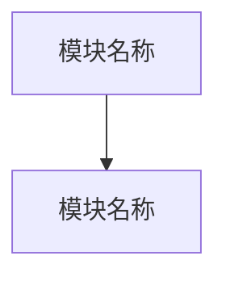

# 模块规划

## 使用说明

- 本文件用于在正式撰写 PRD 正文前确认模块拆分、页面/菜单功能覆盖、依赖关系、开发顺序和可并行项。
- 模块数量不预设固定值，应根据产品定型稿、当前 PRD 模板、功能复杂度、页面入口、数据对象、权限差异和工程交付边界动态拆分。
- 当功能行为、权限、数据对象或验收标准存在明显差异时，应拆成更小模块；只有当多个能力共享同一用户流程、业务规则和工程归属时，才合并为一个模块。
- 模块 ID 使用序号。若出现跳号、重复编号或与 PRD 正文不一致，必须先修正规划，再继续写作。
- 本文件更新后，必须在聊天中输出规划摘要供用户确认；不能只让用户自行打开文件查看。
- 该章节仅指导你如何去生成模块规划文档，在正式生成时不要输出本章节内容。

## 规划依据

- 来源定型稿：
- PRD 模板：
- 模块拆分原则：按用户流程、页面菜单、后台能力、外部接口、数据依赖和工程交付边界动态拆分，不预设固定模块数量。

## 模块清单

模块清单用于确认每个模块的边界、目标用户和依赖关系。范围要写清包含什么、不包含什么，避免后续 PRD 追加时反复返工。

| ID | 模块 | 模块目标 | 范围 | 主要用户/对象 | 依赖 |
|----|------|----------|------|---------------|------|
|  1  | F01  |          |      |               |      |

## 功能清单

按页面、菜单或入口维度列出功能覆盖。该清单用于让产品、设计和研发从界面入口理解功能范围，并与 PRD 正文中的需求总览保持一致。

| 页面/菜单 | 模块 | 功能 | 功能说明 |
|-----------|------|------|----------|
|           |      |      |          |

## 模块依赖图

必须使用 Mermaid flowchart 或同等图表形式展示依赖关系。重点关注登录权限、系统配置、基础数据、外部接口、AI 上下文、数据流转和报告/看板等前置依赖。

## 建议开发顺序

开发顺序应说明为什么先做、为什么后做。常见排序依据包括：基础权限、系统配置、核心数据对象、主业务流程、增强能力、报表看板、审计日志等。具体顺序必须根据当前定型稿调整，不能照搬示例。

| 顺序 | 模块 | 原因 |
|------|------|------|
| 1 | F01 | |

## 可并行开发建议

- 可并行模块：
- 并行前提：
- 不建议并行的模块及原因：

## 用户确认清单

请用户确认以下内容后，再开始撰写 PRD 正文：

- 模块拆分是否合理，是否存在过大、过小或遗漏的模块。
- 页面/菜单功能覆盖是否完整。
- 模块依赖关系是否符合真实业务和工程实现顺序。
- 建议开发顺序是否符合 MVP 优先级和交付节奏。
- 哪些模块可以并行，哪些模块必须等待前置依赖完成。

## 当前评审状态

等待用户确认模块清单、页面菜单功能清单、依赖关系和开发顺序。确认后再从当前 PRD 模板的首个正文写作单元开始正式撰写 PRD 正文。
